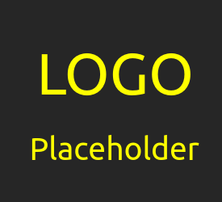

<!-- PROJECT SHIELDS -->
<!--
*** We are using markdown "reference style" links for readability.
*** Reference links are enclosed in brackets [ ] instead of parentheses ( ).
*** See the bottom of this document for the declaration of the reference variables
*** for contributors-url, forks-url, etc. This is an optional, concise syntax you may use.
*** https://www.markdownguide.org/basic-syntax/#reference-style-links
-->
[![Contributors][contributors-shield]][contributors-url]
[![Forks][forks-shield]][forks-url]
[![Stargazers][stars-shield]][stars-url]
[![Issues][issues-shield]][issues-url]
[![MIT License][license-shield]][license-url]
[![LinkedIn][linkedin-shield]][linkedin-url]

<!-- PROJECT LOGO -->
 

  

  <h3 align="center">KobaniAnalysis</h3>

  

    Analysis of Phonology and Morphology in the Kobani Dialect
     
    <a href="https://github.com/christianschuler8989/KobaniAnalysis/tree/main/docs"><strong>Explore the docs »</strong></a>
     
  

<!-- TABLE OF CONTENTS -->

  
Table of Contents

  <ol>
    <li>
      <a href="#about-the-project">About The Project</a>
      <ul>
      	<li><a href="#poster-presented-at-the-ickl-6-in-2023">ICKL-6 Poster</a></li>
        <li><a href="#built-with">Built With</a></li>
      </ul>
    </li>
    <li><a href="#roadmap">Roadmap</a></li>
    <li><a href="#contributing">Contributing</a></li>
    <li><a href="#license">License</a></li>
    <li><a href="#contact">Contact</a></li>
    <li><a href="#acknowledgments">Acknowledgments</a></li>
  </ol>

<!-- ABOUT THE PROJECT -->
## About The Project

[![Project Name Screen Shot][project-screenshot]](https://github.com/Low-ResourceDialectology/KobaniAnalysis)

This is a computer-aided analysis of the Kurdish dialect Kobani, based on speech data collected from dozens of native speakers from various villages of that region.

[![Project Motivation Screen Shot][project-idea]](https://github.com/Low-ResourceDialectology/KobaniAnalysis)
Placement of the Kobani dialect in the Kurdish language family tree. (Original tree based on (Khalid, 2020)).

The Kobani dialect has been neglected by research in the past and is in dire need of being properly analyzed.

(<a href="#readme-top">back to top</a>)

### Poster presented at the ICKL-6 in 2023

The International Conference on Kurdish Linguistics ([ICKL](https://www.uni-frankfurt.de/131978051/Call-for-Papers-ICKL-6)) is a biannual conference serving as a forum of scientific exchange for linguists working on any aspect of Kurdish, including the interactions with its neighboring languages. 

[![Project Poster Screen Shot][project-poster-ickl-png]](https://github.com/Low-ResourceDialectology/KobaniAnalysis)
[The poster as pdf](https://github.com/Low-ResourceDialectology/KobaniAnalysis/blob/main/images/2023_ICKL_KobaniAnalysis_Poster.pdf)

### Built With

List of major frameworks/libraries used to bootstrap this project.

* R
* KLPT
* Whisper
* eSpeak

(<a href="#readme-top">back to top</a>)

<!-- ROADMAP -->
## Roadmap

- [x] Set up this Repository
- [ ] Phase 1: Data Collection
    - [x] Reasoning
        - [x] Target Informants
        - [x] Fieldworker Instruction
        - [x] Interviewing Process
    - [ ] Automated Visualizations
        - [ ] GeoData (partially)
        - [x] Demographic Information
- [ ] Phase 2: Computer-aided Analysis
    - [ ] Preprocessing of Speech Data
        - [ ] Transcription (partially)
        - [ ] Translation
        - [ ] Quality Control
    - [ ] Natural Language Processing
        - [ ] KLPT
        - [ ] Whisper (partially)
        - [ ] eSpeak
- [ ] Phase 3: Phonology & Morphology
    - [ ] Linguistic Analysis
        - [ ] Kobani Phonology (partially)
        - [ ] Kobani Morphology (partially)
    - [ ] Condense Results and Conclusions
        - [ ] Visualizations
        - [ ] Link to Publications
        - [ ] Implications for Future Research

See the TODO: [open issues](https://github.com/christianschuler8989/KobaniAnalysis/issues) for a full list of proposed features (and known issues).

(<a href="#readme-top">back to top</a>)

<!-- CONTRIBUTING -->
## Contributing

Contributions are what make the open source community such an amazing place to learn, inspire, and create. Any contributions you make are **greatly appreciated**.

If you have a suggestion that would make this better, please fork the repo and create a pull request. You can also simply open an issue with the tag "enhancement".
Don't forget to give the project a star! Thanks again!

1. Fork the Project
2. Create your Feature Branch (`git checkout -b feature/AmazingFeature`)
3. Commit your Changes (`git commit -m 'Add some AmazingFeature'`)
4. Push to the Branch (`git push origin feature/AmazingFeature`)
5. Open a Pull Request

(<a href="#readme-top">back to top</a>)

<!-- LICENSE -->
## License

Distributed under the Apache License. See `LICENSE.txt` for more information.

(<a href="#readme-top">back to top</a>)

<!-- CONTACT -->
## Contact

[Raman Ahmad](https://github.com/RamanAhmad.github.io/) - raman.ahmad2022(4T)gmail.com

[Christian Schuler](https://christianschuler8989.github.io/) - christianschuler8989(4T)gmail.com

Related project of the authors: [Towards a complete Mapping of Kurdish Dialectology](https://github.com/Low-ResourceDialectology/DialectMapping)

(<a href="#readme-top">back to top</a>)

<!-- ACKNOWLEDGMENTS -->
## Acknowledgments

A list of helpful resources we would like to give credit to:

* [Best-README-Template](https://github.com/othneildrew/Best-README-Template) 

(<a href="#readme-top">back to top</a>)

<!-- MARKDOWN LINKS & IMAGES -->
<!-- https://www.markdownguide.org/basic-syntax/#reference-style-links -->
[contributors-shield]: https://img.shields.io/github/contributors/christianschuler8989/KobaniAnalysis.svg?style=for-the-badge
[contributors-url]: https://github.com/christianschuler8989/KobaniAnalysis/graphs/contributors
[forks-shield]: https://img.shields.io/github/forks/christianschuler8989/KobaniAnalysis.svg?style=for-the-badge
[forks-url]: https://github.com/christianschuler8989/KobaniAnalysis/network/members
[stars-shield]: https://img.shields.io/github/stars/christianschuler8989/KobaniAnalysis.svg?style=for-the-badge
[stars-url]: https://github.com/christianschuler8989/KobaniAnalysis/stargazers
[issues-shield]: https://img.shields.io/github/issues/christianschuler8989/KobaniAnalysis.svg?style=for-the-badge
[issues-url]: https://github.com/christianschuler8989/KobaniAnalysis/issues
[license-shield]: https://img.shields.io/github/license/christianschuler8989/KobaniAnalysis.svg?style=for-the-badge
[license-url]: https://github.com/christianschuler8989/KobaniAnalysis/blob/main/LICENSE
[linkedin-shield]: https://img.shields.io/badge/-LinkedIn-black.svg?style=for-the-badge&logo=linkedin&colorB=555
[linkedin-url]: https://www.linkedin.com/in/christian-schuler-59090a177/
[project-screenshot]: images/KobaniAnalysis-Concept.png
[project-idea]: images/KobaniAnalysis-LangFamily.png
[project-poster-ickl-png]: images/2023_ICKL_KobaniAnalysis_Poster.png
[project-poster-ickl-pdf]: images/2023_ICKL_KobaniAnalysis_Poster.pdf

